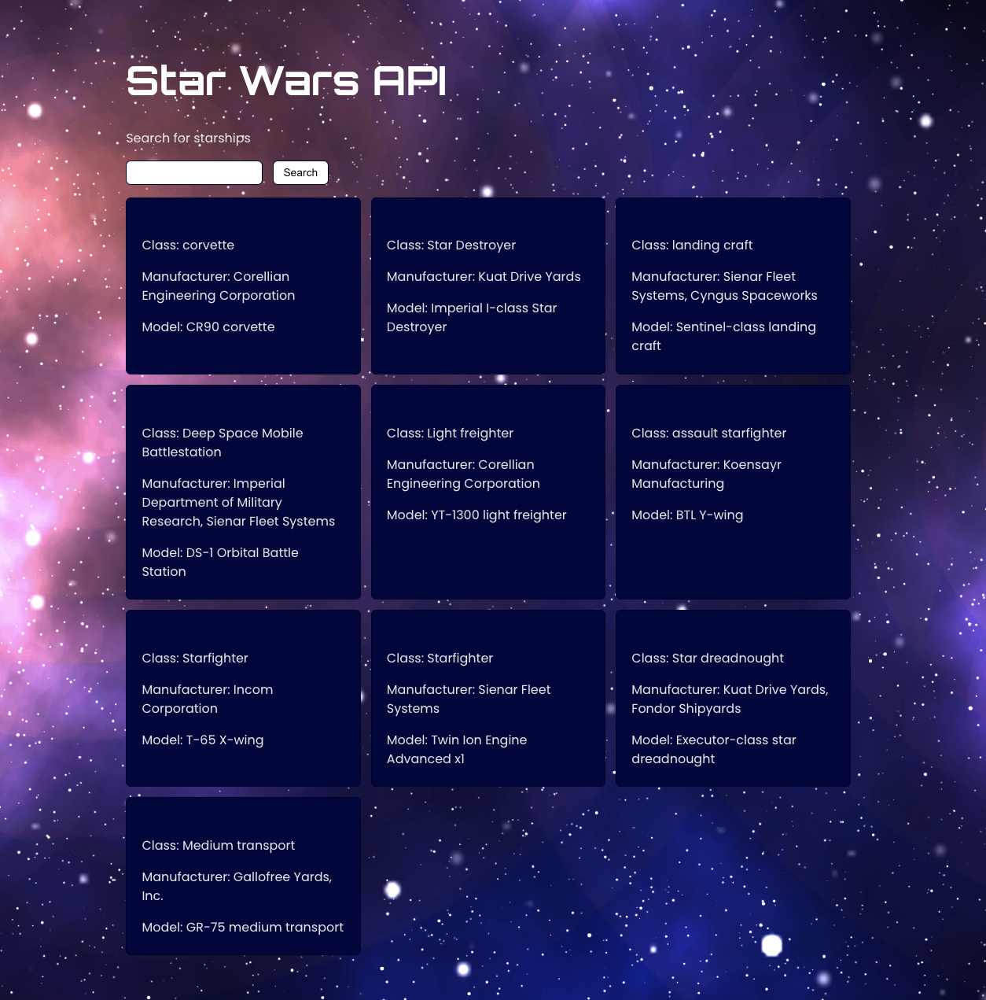

## Fetching Data in React

Learn how to use fetch() in React to fetch data from an API with the Star Wars API https://swapi.dev/.

Clone this repository at https://github.com/AlejandraValdivia/starwars-api-react

Install dependencies
`npm install`

Go to http://localhost:5173

