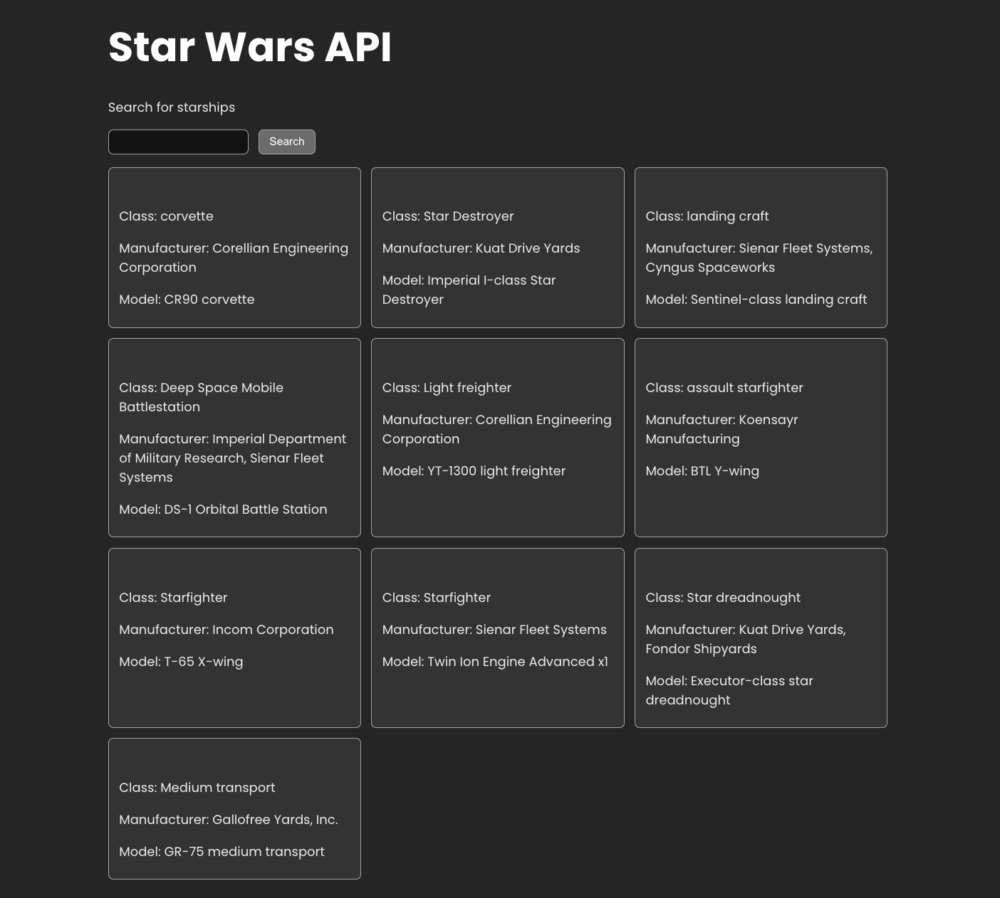

## Fetching Data in React

Learn how to use fetch() in React

Clone this repository at https://github.com/AlejandraValdivia/fetching-data-in-react-lab

Install dependencies
`npm install`

Go to http://localhost:5173

